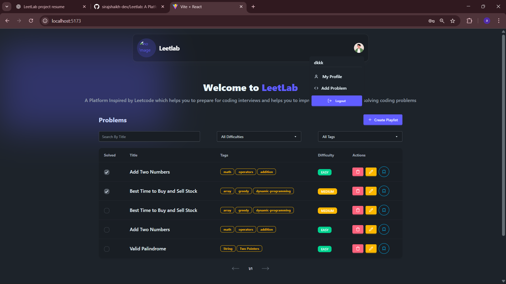
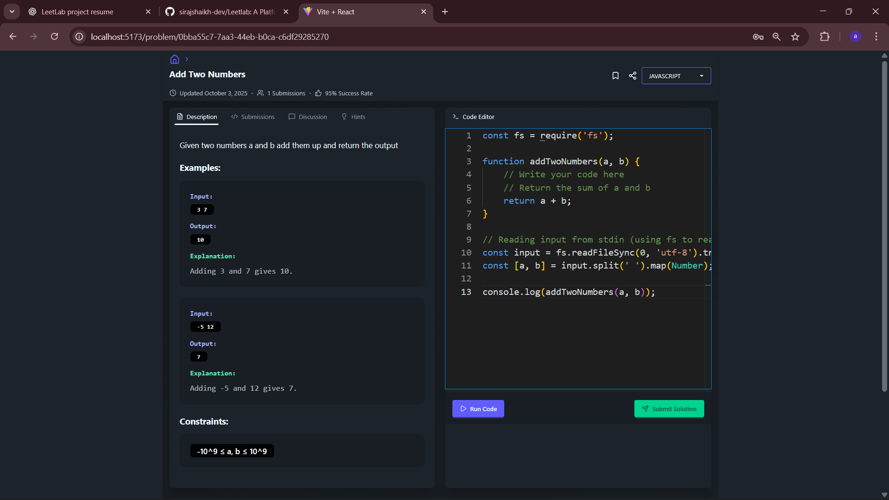
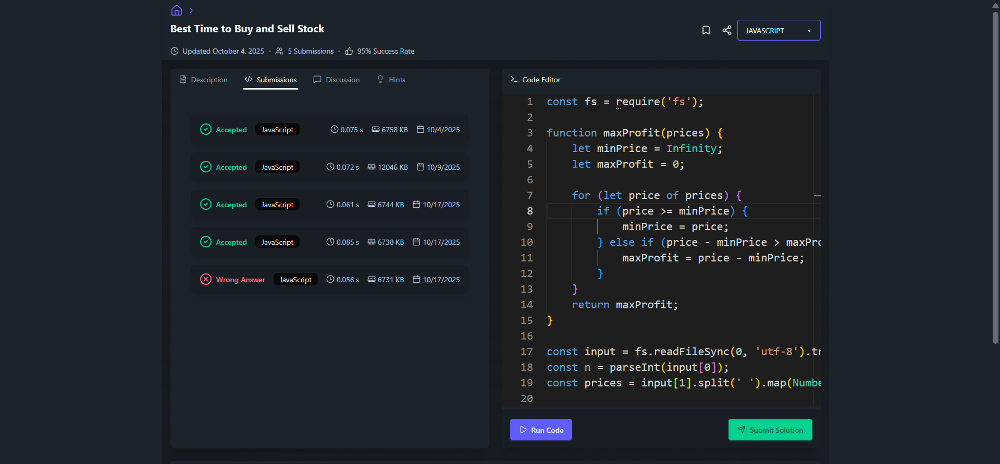
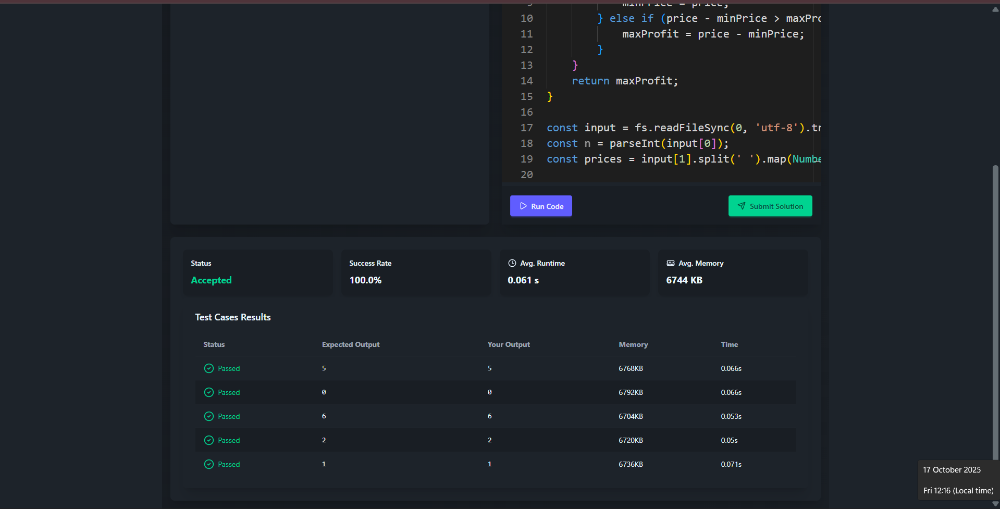
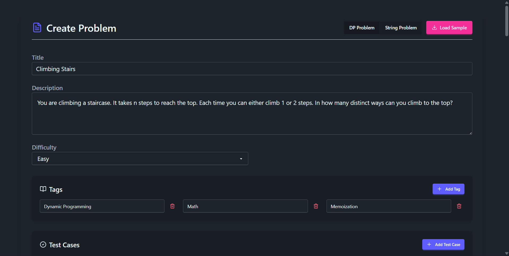
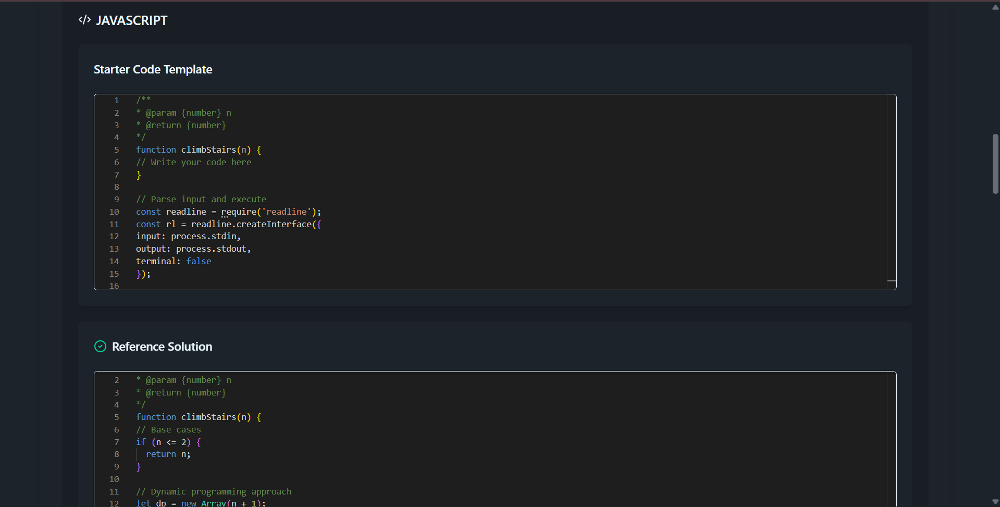
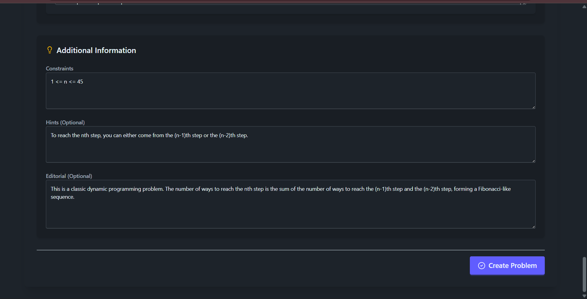

# 🧠 LeetLab – A Leetcode-Inspired Coding Platform

> **LeetLab** is a full-stack, Leetcode-style coding practice platform that enables developers to **solve coding problems**, **run and submit code**, and **track performance** across multiple programming languages — all within a modern, responsive UI.

---
## 📸 Screenshots

| Home / Problem List | Problem Editor |
|----------------------|----------------|
|  |  |

| Submissions  | TestCases |
|----------------------|----------------|
|  |  |

| Create/Add Problem (Admin Only)  | Starter Code |
|----------------------|----------------|
|  |  |
|  |

---

## 🚀 Tech Stack

**Frontend:** React.js, Tailwind CSS, DaisyUI, Zustand, Monaco Editor  
**Backend:** Node.js, Express.js, Prisma ORM, Zod, JWT Authentication  
**Database:** PostgreSQL (Dockerized)  
**Code Execution:** Judge0 API (Dockerized)  
**Containerization:** Docker & Docker Compose  
**Version Control:** Git + GitHub  

---

## 🌟 Features

### 👩‍💻 User Features
- Solve coding problems in **JavaScript**, **Python**, and **Java**
- **Run & Submit Code** in real-time using the **Judge0 API**
- **Track submissions** with details like runtime, memory usage, and verdict (Accepted, Wrong Answer, etc.)
- **Save problems to playlists** for revisiting later
- **Filter problems** by difficulty, tags, and title for quick navigation
- Access **examples, constraints, and editorial hints**
- Beautiful **dark mode interface** with Tailwind CSS + DaisyUI
- Fully **responsive UI** optimized for desktop and mobile

### 🧑‍💼 Admin Features
- Dedicated **Admin Dashboard** with full CRUD functionality
- Create, edit, and delete problems dynamically
- Manage test cases, problem descriptions, tags, and difficulty levels
- Monitor user submissions and platform activity

---

## 🧩 Core Highlights

- **Real-Time Code Execution** via Dockerized Judge0 API  
- **Schema-based validation** using Zod for strong input handling  
- **JWT-based authentication** for secure and scalable session management  
- **Prisma ORM** with PostgreSQL for fast, type-safe queries  
- **Global state management** powered by Zustand for optimal React performance  
- **Containerized backend and database** using Docker for easy deployment and scalability  

---

